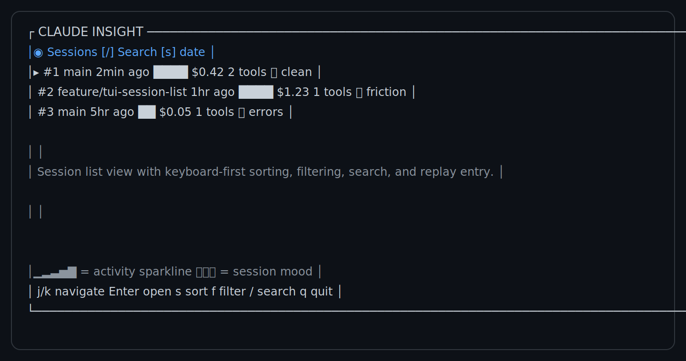
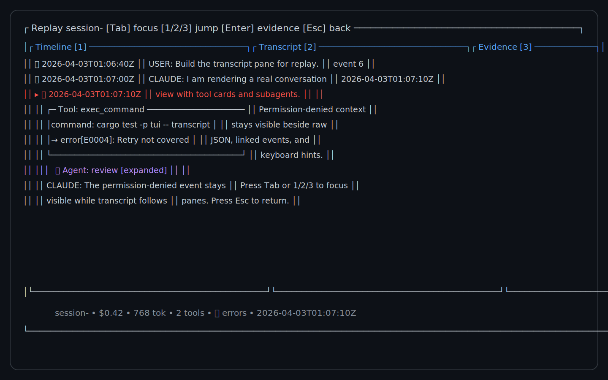

# Claude Insight

Claude Insight is a local observability and audit system for Claude Code.
It captures hook events, preserves the raw evidence chain, normalizes those
events into queryable SQLite tables, and gives you a terminal UI for replaying
sessions with lazygit-style energy.

It is intentionally an evidence-chain system, not a reasoning-extraction
system. The goal is to answer questions like:

- What happened in this Claude Code session?
- Which tool calls ran, in what order, and with which results?
- Which instructions loaded before a decision?
- Which permission prompts were asked, allowed, or denied?

## Why Claude Insight

- Local-first storage with no cloud dependency for the core workflow
- Append-only raw capture with backlog recovery when the daemon is down
- SQLite typed tables plus FTS5 search across captured sessions
- Ratatui replay views for timeline, transcript, and evidence details
- CLI tools for setup, tracing, search, and retention cleanup

## TUI Preview

The screenshots below are generated from the current Ratatui snapshot fixtures,
so they stay close to the UI that the tests verify.





## Installation

Current supported path while the public distribution rollout is still in
progress:

```bash
git clone git@github.com:eddieran/claude-insight.git
cd claude-insight
cargo build --release
```

The release binary is available at `target/release/claude-insight`.

Planned published install paths, once the package release and tap update are
live:

### 1. Install from Cargo

```bash
cargo install claude-insight --locked
```

Upgrade an existing published Cargo install:

```bash
cargo install claude-insight --locked --force
```

Remove the Cargo-installed binary:

```bash
cargo uninstall claude-insight
```

### 2. Install from Homebrew

```bash
brew tap eddieran/tap
brew install claude-insight
```

Upgrade or remove the published Homebrew install:

```bash
brew upgrade claude-insight
brew uninstall claude-insight
brew untap eddieran/tap
```

### 3. Download a release binary

1. Open the GitHub Releases page for this repository.
2. Download the archive for your platform and architecture.
3. Unpack it and place `claude-insight` somewhere on your `PATH`.

Upgrade by replacing the old binary with the newly downloaded one. Remove it by
deleting the installed `claude-insight` executable from your `PATH`.

Release artifacts are expected for Linux, macOS, and Windows on amd64 and
arm64, along with `SHA256SUMS` and a generated `claude-insight.rb` formula file
for Homebrew tap updates.

## Quick Start

Run these two commands to install the hooks globally and then open the app:

```bash
claude-insight init --global
claude-insight
```

`init --global` updates `~/.claude/settings.json`, enables Claude Insight hook
entries for all supported Claude Code events, and starts the local daemon.

On first launch, `claude-insight` opens the first-run wizard if there is no
local database yet. Once sessions exist, the same bare command renders the
default session home screen instead of falling back to clap help text.

By default, Claude Insight stores state under `~/.claude-insight/`:

- `insight.db` for SQLite data
- `backlog.jsonl` for append-only fallback capture
- `daemon.pid` for daemon lifecycle tracking
- `transcript_offsets.json` for transcript tailing progress

## Usage

### Trace a session

Follow one session by its identifier:

```bash
claude-insight trace <session_id>
```

Run `claude-insight trace` with no session id to list recent sessions first.

### Search across captured events

Search the FTS index for matching tools, prompts, file paths, and payloads:

```bash
claude-insight search "Bash"
```

### Garbage-collect old evidence

Remove raw events and normalized session rows older than ninety days:

```bash
claude-insight gc --days 90
```

### Other useful commands

```bash
claude-insight serve
claude-insight normalize --rebuild
claude-insight daemon start
claude-insight daemon stop
```

## Release Validation

The release workflow packages versioned archives, emits `SHA256SUMS`, generates
the Homebrew formula payload, and runs an installed-binary smoke check through:

```bash
./scripts/package-release-assets.sh v0.1.0 dist/raw dist/release
./scripts/validate-installed-binary.sh --artifact-dir dist/release
```

The installed-binary validation always covers `--help`, the default launcher,
`init --global`, hook forwarding, `trace`, and `search`. A real `claude -p`
walkthrough remains conditional on local Claude availability/auth and can be
recorded alongside the scripted smoke logs when release evidence is gathered.

## What The TUI Shows

The TUI is designed around a replay workflow:

- `Timeline`: event markers, ordering, and activity density
- `Transcript`: user and assistant turns, tool cards, and subagent sections
- `Evidence`: raw JSON, permission decisions, linked events, and instruction
  provenance

The session list view also shows:

- mood badges for clean, friction, and error-heavy sessions
- ASCII sparklines for activity bursts
- keyboard-driven search, filtering, and navigation

## Architecture At A Glance

Claude Insight has four main moving parts:

1. Claude Code hooks emit structured event payloads.
2. The daemon captures those payloads and appends the raw evidence stream.
3. The storage layer normalizes raw evidence into typed SQLite tables and FTS.
4. The CLI and TUI query that local evidence graph for replay and search.

For the full system walkthrough, see [ARCHITECTURE.md](ARCHITECTURE.md).

## Repository Layout

```text
crates/
  capture/   HTTP hook receiver, backlog writer/processor, transcript tailer
  cli/       clap-based binary entry point
  daemon/    daemon lifecycle and background services
  storage/   SQLite schema, raw store, normalizer, FTS, retention
  tui/       Ratatui views, keyboard flow, evidence rendering, wizard
  types/     shared hook and transcript types
docs/
  DESIGN.md
  ENGINEERING.md
  TEST_PLAN.md
```

## Development

See [CONTRIBUTING.md](CONTRIBUTING.md) for local setup, test commands, and PR
workflow details.

## License

Claude Insight is available under the [MIT License](LICENSE).
