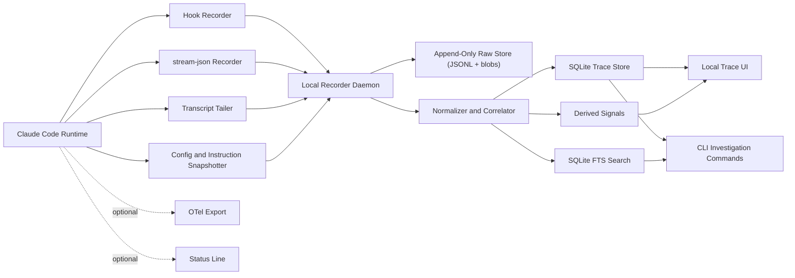
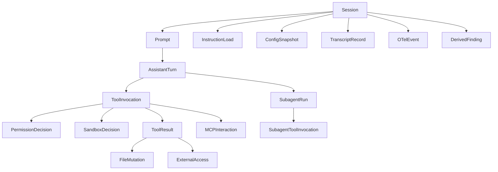

# Claude Code Visibility System Design

Source inputs for this spec:

- Shared discussion thread: `https://chatgpt.com/share/69ce5188-1c24-839a-a756-658fd4138495`
- Official Claude Code docs under `https://code.claude.com/docs/en/`
- Local empirical probes captured with Claude Code `2.1.81`
- Probe artifacts in `.research/claude-hook-probe/`

## 1. Executive Summary

This document defines a high-level design for a Claude-Code-centered visibility system that makes local agent execution auditable, explainable, and operationally useful without attempting to expose hidden chain-of-thought.

The core principle follows the source discussion:

> Do not chase hidden reasoning. Build an evidence chain for where context came from, which tools ran, which permission and sandbox decisions were made, and what outputs were produced.

The system is designed around real Claude Code surfaces we can actually access today:

- Hook lifecycle events
- `claude -p --output-format stream-json --verbose`
- Conversation transcript JSONL files referenced by `transcript_path`
- OpenTelemetry metrics and events
- Status line stdin JSON
- Settings, permissions, sandbox, memory, subagents, and MCP-related metadata

This is a high-level architecture and product spec. It intentionally avoids schema-level detail while being concrete enough to drive implementation planning.

## 1.1 What This Optimized Revision Changes

The original version was intentionally comprehensive. This optimized revision makes the design more opinionated so it is easier to build correctly:

- V1 is now explicitly a `local evidence recorder + trace explorer`, not a broad observability platform.
- The architecture spine is `hooks + transcript + stream-json + config snapshots`, with OTel treated as a later aggregation layer rather than part of the critical path.
- The recommended persistence layer is `SQLite + FTS + append-only JSONL/blob artifacts`, which is fast enough for local use and easy to trust.
- Status line integration is repositioned as an optional operator surface, not a core ingestion dependency.
- Metadata-first capture is the default product posture; full prompt and tool payload storage is optional and policy-gated.
- Hosted team mode is deferred until the local trace model is proven stable across Claude Code versions.

The result is a design with fewer moving parts in V1, clearer trust boundaries, and a shorter path to a genuinely useful product.

## 1.2 Architectural Decision Summary

| Decision | Choice | Why this is the right default |
| --- | --- | --- |
| Product shape | Local recorder plus trace explorer | Solves the debugging and audit problem before expanding into platform scope |
| Core evidence sources | Hooks, transcript JSONL, `stream-json`, config snapshots | These are the highest-fidelity sources we can actually access today |
| Forensic source of truth | Raw append-only artifacts | Lets us recover from parser bugs and Claude version drift |
| Normalized store | SQLite plus FTS | Lowest operational overhead with strong local query performance |
| Content policy | Metadata-first, content-optional | Preserves privacy and reduces accidental secret retention |
| OTel role | Aggregation and analytics only | Useful for trends, but too lossy to be the core replay substrate |
| Status line role | Optional operator surface | High UX value, low architectural importance |
| Hosted mode timing | After local trace stability | Prevents scaling an unstable event model too early |

## 2. Problem Statement

Claude Code is powerful locally because it can read project context, load `CLAUDE.md` instructions, call tools, spawn subagents, use MCP integrations, and make permission-bound decisions in an agent loop. But local usage often lacks a clean answer to questions like:

- What exact context entered the session?
- Which instruction files were loaded, and when?
- What prompt triggered a tool call?
- Why was a tool allowed, denied, retried, or sandboxed?
- What files changed and which tool or turn caused the change?
- Which external systems were touched through Bash, WebFetch, or MCP?
- How much of the session can be reconstructed after the fact?

Without that visibility:

- Developers cannot debug agent behavior efficiently.
- Security teams cannot audit sensitive actions confidently.
- Platform teams cannot distinguish cost telemetry from execution truth.
- Teams over-focus on hidden reasoning instead of observable evidence.

## 3. Goals

### 3.1 Primary Goals

- Provide a faithful evidence trail for local Claude Code execution.
- Reconstruct prompt-to-action lineage across sessions, turns, tools, and outputs.
- Show context provenance, especially instruction loading and tool-access boundaries.
- Make permission and sandbox decisions inspectable.
- Support both debugging workflows and audit/compliance workflows.
- Preserve privacy by default and separate metadata from sensitive content.

### 3.2 Secondary Goals

- Support local-only mode and team-hosted mode.
- Enable incident investigation and prompt-injection forensics.
- Surface derived operational signals such as friction, failure loops, and exfiltration risk.
- Work with both interactive sessions and non-interactive `claude -p` flows.

### 3.3 Non-Goals

- Reconstruct or reveal hidden chain-of-thought.
- Depend on unpublished Claude internal system prompts.
- Replace Claude Code itself or intercept every internal runtime detail.
- Start with perfect semantic attribution of "why the model thought X."

## 4. Design Principles

### 4.1 Evidence Over Introspection

We prioritize observable artifacts:

- inputs
- configuration
- loaded instructions
- tool calls
- tool results
- permission outcomes
- transcript entries
- telemetry events

Instead of attempting to infer private reasoning.

### 4.2 Source-Graded Truth

Every field in the system should carry a provenance grade:

- `documented`: stated in official Claude Code docs
- `empirical`: observed directly from a local probe
- `derived`: computed by our system from other evidence
- `inferred`: likely true, but not directly guaranteed

### 4.3 Local-First, Team-Extensible

The system should work on a single laptop with no server, then scale to:

- shared team dashboards
- organization analytics
- compliance retention
- cross-session analysis

### 4.4 Privacy By Default

Content capture should be opt-in or tiered. Metadata capture should be default-safe.

### 4.5 Separation Of Control Plane And Content Plane

We should treat:

- metadata about actions
- raw prompt/tool/file content

as different sensitivity classes with different storage, retention, and access policies.

## 5. Canonical Source Of Truth

## 5.1 Official Documentation Base

The canonical public docs base is:

- `https://code.claude.com/docs/en/...`

Some older/public entry points redirect from:

- `https://docs.anthropic.com/en/docs/claude-code/...`

For this project, the correct primary documentation source should be treated as `code.claude.com`, with redirecting Anthropic URLs accepted as aliases.

## 5.2 Official Docs Relevant To This Design

- Hooks: `https://code.claude.com/docs/en/hooks`
- Settings: `https://code.claude.com/docs/en/settings`
- Permissions: `https://code.claude.com/docs/en/permissions`
- Sandboxing: `https://code.claude.com/docs/en/sandboxing`
- Memory: `https://code.claude.com/docs/en/memory`
- Subagents: `https://code.claude.com/docs/en/sub-agents`
- Status line: `https://code.claude.com/docs/en/statusline`
- Monitoring / OpenTelemetry: `https://code.claude.com/docs/en/monitoring-usage`
- Security: `https://code.claude.com/docs/en/security`

## 5.3 Empirically Verified Local Artifacts

The following were directly observed using `claude -p` probes on local Claude Code `2.1.81`:

- stream-json event frames from `claude -p --output-format stream-json --verbose`
- hook stdin payloads for:
  - `SessionStart`
  - `UserPromptSubmit`
  - `PreToolUse`
  - `PostToolUse`
  - `Stop`
- transcript JSONL structure referenced by `transcript_path`

Probe artifacts currently live under:

- `.research/claude-hook-probe/`

and transcript samples were captured from:

- `~/.claude/projects/-Users-sure-Projects-AgentInsight/`

## 5.4 Why This Matters

The visibility system should never pretend undocumented fields are stable. The design must explicitly distinguish:

- what Claude documents
- what we observed
- what we compute ourselves

## 6. What Claude Code Actually Exposes

## 6.1 Observable Surface Map

| Surface | What it gives us | Fidelity | Best use |
| --- | --- | --- | --- |
| Hooks | lifecycle events, tool I/O, instruction loads, permission events | high | audit trail, synchronous policy points |
| `stream-json` | run metadata, assistant messages, result summaries | high | session-level trace ingestion |
| Transcript JSONL | ordered turn and tool-result history | high | replay, lineage, recovery |
| OpenTelemetry | metrics and event stream | medium-high | org dashboards, alerts, trend analysis |
| Status line stdin JSON | current session summary state | medium | live inline UX, lightweight monitoring |
| Settings / config files | effective policy and environment | medium-high | permission provenance, trust boundaries |
| `CLAUDE.md` / rules | instruction provenance | high | context source audit |
| Subagent and MCP metadata | delegation and external tool topology | medium-high | system map and trust map |

## 6.2 Hook Events Most Important To Visibility

The docs expose a broad event set. The high-value events for a first version are:

- `SessionStart`
- `InstructionsLoaded`
- `UserPromptSubmit`
- `PreToolUse`
- `PermissionRequest`
- `PermissionDenied`
- `PostToolUse`
- `PostToolUseFailure`
- `SubagentStart`
- `SubagentStop`
- `Stop`
- `StopFailure`
- `ConfigChange`
- `CwdChanged`
- `PreCompact`
- `PostCompact`
- `SessionEnd`

Second-wave value:

- `Notification`
- `FileChanged`
- `WorktreeCreate`
- `WorktreeRemove`
- `Elicitation`
- `ElicitationResult`
- `TaskCreated`
- `TaskCompleted`
- `TeammateIdle`

## 6.3 Important Officially Documented Visibility Facts

- `InstructionsLoaded` fires when `CLAUDE.md` or `.claude/rules/*.md` files enter context.
- Hook input arrives as JSON on stdin for command hooks.
- `SessionStart`, `UserPromptSubmit`, and async hook completions can inject context back into Claude.
- Status line scripts receive structured JSON on stdin.
- OpenTelemetry can export both metrics and event logs.
- `prompt.id` in OTel is intended to correlate activity triggered by a single user prompt.
- MCP tools appear with names like `mcp__<server>__<tool>`.
- Permissions and sandboxing are separate but complementary layers.

## 6.4 Important Empirical Facts

Observed locally in real `claude -p` runs:

- stream-json `init` events expose `cwd`, `session_id`, `tools`, `mcp_servers`, `model`, `permissionMode`, `claude_code_version`, `agents`, `skills`, `plugins`, and more
- `UserPromptSubmit` hook payload includes raw prompt text
- `PreToolUse` hook payload includes tool name, tool arguments, and `tool_use_id`
- `PostToolUse` hook payload includes stdout/stderr-backed tool response
- `Stop` hook payload includes `last_assistant_message`
- transcript JSONL records assistant tool-use frames and tool-result frames as explicit entries

## 7. Product Positioning

This system is not a "thought viewer." It is an "agent evidence graph."

The product should help users answer:

- What happened?
- What triggered it?
- What context was available?
- What policy allowed or blocked it?
- What changed in the world or codebase?

The product should not promise:

- exact internal reasoning
- exhaustive cognitive replay
- semantic certainty about model motivation

## 8. User Personas And Core Jobs

## 8.1 Developer

Needs to:

- debug surprising tool calls
- understand why a file changed
- replay a failed session
- inspect loaded instructions and MCP usage

## 8.2 Security / Platform Engineer

Needs to:

- audit risky commands
- inspect permission and sandbox behavior
- trace external network or MCP access
- enforce retention and redaction policy

## 8.3 Engineering Manager / Ops

Needs to:

- see utilization and cost trends
- understand friction and failure patterns
- identify high-risk sessions without reading all content

## 8.4 AI Platform Builder

Needs to:

- validate that hooks, policies, and subagents are behaving correctly
- compare documented capability versus observed runtime output
- decide which signals are stable enough to productize

## 9. System Scope

## 9.1 In Scope For V1

- Local Claude Code sessions
- Non-interactive `claude -p` sessions
- Hook-based capture
- Transcript ingestion
- Config and instruction snapshotting
- Permission and sandbox visibility
- Instruction provenance
- Tool and subagent lineage
- Session replay and search
- Local CLI and lightweight local web UI
- SQLite-backed normalized trace storage
- Redaction-aware artifact storage for raw payloads

## 9.2 Out Of Scope For V1

- Full multi-agent cross-vendor abstraction
- Rich IDE plugin implementation
- Automatic code-diff semantic explanation
- Full DLP enforcement engine
- Hosted multi-user backend
- Fleet-wide analytics and alerting as a primary deliverable
- Status line as a required dependency
- OTel as a source of forensic truth

## 10. Architecture Overview

## 10.1 Architectural Layers

### Layer 1: Runtime Adapters

Collect evidence from Claude Code in its native forms.

### Layer 2: Ingestion Bus

Run a single local recorder process that accepts heterogeneous events with minimal transformation.

### Layer 3: Normalization And Correlation

Convert raw artifacts into a consistent event graph.

### Layer 4: Storage

Use a dual-store model:

- append-only raw artifacts for trust and reprocessing
- SQLite for normalized traces and local search

### Layer 5: Serving And UX

Support replay, audit, and debugging first. Treat analytics and alerting as second-wave capabilities.

## 11. Detailed Component Design

## 11.1 Hook Capture Layer

The hook layer is the most important first-party observability surface because it exposes execution edges close to decision time.

Responsibilities:

- capture hook stdin JSON verbatim
- timestamp receipt time
- tag source event type
- attach host identity and Claude version if known
- avoid blocking Claude unless intentionally acting as policy
- optionally return context to Claude only when configured

Design rules:

- use append-only capture
- store raw payload first, then parse
- keep hook handlers small and fast
- prefer async for pure logging on non-critical events
- distinguish "policy hooks" from "audit hooks"

Recommended split:

- `audit hooks`: passive capture only
- `guard hooks`: blocking or denying risky actions
- `enrichment hooks`: add limited context only when needed

## 11.2 stream-json Adapter

For non-interactive flows, `claude -p --output-format stream-json --verbose` is a high-fidelity run channel.

Responsibilities:

- capture every emitted frame in order
- identify frame types such as `system`, `assistant`, `result`
- preserve `session_id`, request/result timing, model usage, and cost
- map assistant tool-use content into the same evidence graph as hook events

Why it matters:

- hooks show lifecycle interception
- stream-json shows session bootstrap and run summary
- transcript shows turn history

Together they provide overlapping but not identical visibility.

## 11.3 Transcript Tailer

The transcript JSONL file referenced by Claude is a durable replay artifact.

Responsibilities:

- tail or ingest transcript snapshots
- reconstruct ordered user / assistant / tool-result event history
- link transcript `uuid`, `parentUuid`, `promptId`, and `toolUseID` relationships
- support delayed consistency if transcript entries arrive after hooks

Key value:

- transcript becomes the canonical replay log
- hooks become the canonical pre/post execution metadata

## 11.4 OpenTelemetry Ingestion

OTel is the right path for fleet-level monitoring, not the sole source for forensic replay.

Responsibilities:

- ingest metrics and event logs
- retain session-level and org-level identifiers
- correlate `prompt.id` with internal prompt lineage when possible
- treat tool details and prompt content as optional high-sensitivity fields

Use cases:

- org dashboards
- alerts
- anomaly detection
- adoption and cost measurement

## 11.5 Status Line Adapter

Status line is not the source of truth, but it is the best low-friction inline surface.

Responsibilities:

- expose live context usage
- display risk and permission posture
- show current trace state and capture health

Good status line outputs:

- context used percentage
- current permission mode
- sandbox enabled / disabled
- active capture status
- pending risky action count

## 11.6 Config Snapshotter

Visibility must include the policy environment, not only runtime actions.

Snapshot inputs:

- `~/.claude/settings.json`
- project `.claude/settings.json`
- project `.claude/settings.local.json` when explicitly allowed
- managed settings if accessible
- `CLAUDE.md`
- `.claude/CLAUDE.md`
- `.claude/rules/*.md`
- `.mcp.json`
- subagent definitions under `.claude/agents/` and `~/.claude/agents/`

Responsibilities:

- record file path, hash, version time, scope, and selected parsed metadata
- never assume full content capture is always allowed
- allow content-free mode with hashes only

## 12. Canonical Evidence Model

The system should normalize all evidence into a graph, not just a list of logs.

## 12.1 Core Entities

### Session

Represents one Claude Code session.

Key fields:

- session id
- cwd
- project dir
- transcript path
- Claude version
- model
- permission mode
- agent / worktree metadata
- start / stop timestamps

### Prompt

Represents a submitted user prompt.

Key fields:

- prompt text or prompt hash
- prompt id if available
- prompt source
- submission time
- related instruction context snapshot

### Assistant Turn

Represents model output between user turns.

Key fields:

- assistant message id
- message content summary
- stop reason
- usage summary

### Tool Invocation

Represents a planned or actual tool call.

Key fields:

- tool name
- tool input
- tool use id
- originating assistant turn
- correlated hook / transcript / OTel references

### Tool Result

Represents actual tool execution output.

Key fields:

- stdout / stderr or references
- success / failure
- duration
- output size
- side-effect summary

### Permission Decision

Represents approval, denial, auto-denial, retry eligibility, or source of decision.

Key fields:

- decision
- source
- rule or mode
- policy scope
- reasoning string if surfaced

### Sandbox Decision

Represents whether Bash executed inside sandbox, what boundaries applied, and what was blocked.

### Instruction Load

Represents a `CLAUDE.md` or rule file entering context.

Key fields:

- file path
- memory type
- load reason
- trigger path
- parent include path

### Subagent Run

Represents a delegated subagent execution.

Key fields:

- subagent type
- model if known
- tool restrictions
- timing
- returned result summary

### MCP Interaction

Represents a tool invocation routed through `mcp__<server>__<tool>`.

Key fields:

- server name
- tool name
- server scope
- elicitation events if any

### Derived Finding

Represents analysis generated by our platform, such as:

- repeated denied actions
- prompt injection suspicion
- unusually large tool output
- context thrash
- untracked file mutation risk

## 12.2 Correlation Keys

The system should prefer native identifiers over fuzzy joins.

Priority keys:

- `session_id`
- `promptId` or `prompt.id`
- `tool_use_id` / `toolUseID`
- transcript `uuid` / `parentUuid`
- `requestId`
- `transcript_path`
- timestamps as tie-breakers, not primary keys

## 13. Data Ingestion Strategy

## 13.1 Ingestion Order

### Tier 1: Must Have

- hook raw payloads
- transcript JSONL
- stream-json frames

### Tier 2: Strongly Recommended

- settings snapshots
- instruction load events
- OTel events

### Tier 3: Nice To Have

- live statusline integration
- file watcher enrichments
- custom proxy/network logs

## 13.2 Raw-First Storage

Store raw records before normalization.

Why:

- Claude fields may change across versions
- normalization bugs are easier to repair
- legal/audit workflows often require the original observed payload

## 13.3 Event Versioning

Every normalized record should include:

- Claude Code version
- adapter version
- normalization version
- source provenance grade

## 14. Storage Architecture

## 14.1 Raw Event Store

Purpose:

- append-only immutable storage
- exact payload preservation
- replay and reprocessing

Candidates:

- local JSONL files
- SQLite blob references
- object storage in hosted mode

## 14.2 Normalized Trace Store

Purpose:

- queryable session graph
- prompt-to-tool lineage
- permission and instruction correlation

Candidates:

- SQLite for local mode
- Postgres for hosted mode
- ClickHouse for high-volume analytics mode

## 14.3 Search Index

Purpose:

- session search
- command search
- file-path search
- instruction-load search

Candidates:

- SQLite FTS in local mode
- OpenSearch / Elasticsearch in hosted mode

## 14.4 Artifact Blob Store

Purpose:

- raw transcript copies
- redacted content snapshots
- large tool outputs
- diff artifacts

## 15. Core Product Experiences

## 15.1 Session Replay

A timeline view that reconstructs:

- session start
- loaded instructions
- prompt submission
- assistant tool decisions
- permission outcomes
- tool execution and results
- final assistant output
- session end

The replay should show both raw evidence and normalized summary.

## 15.2 Prompt-To-Action Trace

Given a prompt, show:

- which instructions were already loaded
- which tools were proposed
- which were allowed or denied
- which outputs came back
- which files changed
- what the final response was

This is the core user mental model.

## 15.3 Instruction Provenance View

Show:

- all `CLAUDE.md` and rules files loaded into context
- order and reason of loading
- scope: user, project, local, managed
- nested traversal or glob-triggered lazy loads

This is essential because instruction provenance is the closest safe alternative to internal system-prompt visibility.

## 15.4 Permission And Sandbox Audit

Show:

- permission mode at the time of action
- matching allow / ask / deny rule if identifiable
- auto-mode denials and retries
- sandbox boundaries active for Bash
- whether execution happened inside or outside sandbox

## 15.5 Tool Lineage View

For a given tool call, show:

- originating assistant turn
- tool arguments
- permission decision
- sandbox posture
- execution result
- downstream file or external effects

## 15.6 MCP Trust Map

Show:

- configured MCP servers
- tools exposed by each server
- which sessions used them
- which prompts triggered them
- whether they requested elicitation
- whether outputs were unusually large

## 15.7 Subagent Trace

Show:

- when a subagent was invoked
- why it was likely invoked
- what tools it had
- what result summary came back

## 15.8 Analytics Dashboard

Aggregate:

- session counts
- cost
- token usage
- denied tool counts
- risky command frequency
- instruction load counts
- MCP server usage
- failure rates

## 16. UX Surfaces

## 16.1 Local Desktop / Web UI

Primary views:

- Sessions
- Trace
- Instructions
- Permissions
- MCP
- Analytics
- Alerts

## 16.2 CLI

Useful commands:

- `vis sessions`
- `vis trace <session_id>`
- `vis tool <tool_use_id>`
- `vis prompt <prompt_id>`
- `vis instructions <session_id>`
- `vis diff <session_a> <session_b>`

## 16.3 Status Line

Minimal operator display:

- permission mode
- sandbox mode
- capture health
- trace ID short form
- context used

## 16.4 Export

Allow export to:

- Markdown investigation report
- JSON evidence bundle
- CSV analytics slice

## 17. Security And Privacy Design

## 17.1 Data Classes

### Class A: Metadata

Examples:

- timestamps
- event names
- tool names
- decision source
- file paths
- counts

### Class B: Sensitive Operational Content

Examples:

- prompts
- tool arguments
- stdout/stderr
- instruction file contents

### Class C: Highly Sensitive Secrets Or Regulated Data

Examples:

- credentials
- secrets in tool output
- proprietary source code segments
- customer data

## 17.2 Default Capture Policy

Recommended default:

- capture metadata by default
- capture content references by default
- capture full prompt / tool payload content only with explicit policy enablement

## 17.3 Redaction Strategy

Redact or hash by default:

- common secret formats
- tokens and API keys
- large command outputs
- exact prompt text in team-wide analytics mode

## 17.4 Access Control

At minimum, separate roles:

- local user
- project maintainer
- security auditor
- platform admin

## 17.5 Retention

Suggested policy split:

- metadata: longer retention
- full content: shorter retention
- secrets-bearing artifacts: shortest retention or never persist

## 17.6 Tamper Evidence

For audit-sensitive deployments:

- append-only raw event log
- per-record hashes
- periodic Merkle root or signed bundle

## 18. Permission And Policy Visibility Model

The system should show policy in three layers:

### Layer 1: Configured Policy

- settings files
- managed settings
- permission rules
- sandbox config

### Layer 2: Runtime Decisions

- allow / ask / deny
- auto-mode decision source
- hook denial
- retry path

### Layer 3: Observed Effects

- tool ran or did not run
- sandbox blocked access or not
- file mutation or network effect happened or not

The user should be able to move cleanly from policy intent to runtime outcome.

## 19. Context Provenance Model

We should explicitly model context sources, not only user prompt text.

Context source categories:

- user prompt
- prior transcript state
- loaded `CLAUDE.md`
- `.claude/rules/*.md`
- settings-driven environment
- hook-added context
- subagent return summaries
- MCP tool results
- compaction summaries

This is the single most important design move if we want meaningful explainability without hidden reasoning access.

## 20. Derived Signals And Detection

The visibility platform should compute useful secondary signals:

### 20.1 Friction Signals

- repeated permission prompts for same action
- repeated denials followed by retries
- high manual-approval burden

### 20.2 Reliability Signals

- tool failure loops
- repeated compaction before task completion
- transcript / hook mismatches

### 20.3 Security Signals

- access attempts outside sandbox boundaries
- risky shell patterns
- new MCP server usage
- unusually broad file reads
- prompt-injection-like sequences

### 20.4 Productivity Signals

- time from prompt to first successful tool
- prompt-to-file-change latency
- session completion rate

## 21. Rollout Plan

## 21.1 Phase 0: Research Baseline

Deliverables:

- probe scripts
- event inventory
- field catalog
- source-of-truth matrix

Status:

- partially completed through local `claude -p` exploration

## 21.2 Phase 1: Local Recorder MVP

Deliver:

- hook capture
- transcript ingestion
- stream-json ingestion
- config and instruction snapshots
- raw local storage
- SQLite normalization pipeline
- basic replay CLI

Success criteria:

- reconstruct a full `prompt -> instruction set -> tool -> result -> assistant output` path for test sessions
- preserve enough raw evidence to reprocess traces after a parser bug or version drift

## 21.3 Phase 2: Local Trace Explorer

Deliver:

- session replay UI
- instruction provenance view
- permission audit view
- tool lineage view
- search across sessions, tools, and files
- redaction-aware artifact drill-down

## 21.4 Phase 3: Derived Signals And OTel

Deliver:

- derived local risk signals
- optional OTel export and ingestion
- dashboards
- alerts
- cross-session analysis

## 21.5 Phase 4: Hosted Team Mode

Deliver:

- shared backend
- RBAC
- retention controls
- export bundles

## 22. Risks And Mitigations

## 22.1 Claude Version Drift

Risk:

- field names or event shapes may change across Claude releases

Mitigation:

- raw-first storage
- version-tag every record
- source-grade every field

## 22.2 Over-Capture Of Sensitive Content

Risk:

- prompts and tool outputs may contain secrets

Mitigation:

- metadata-first defaults
- explicit content capture modes
- redaction and secret scanning

## 22.3 Hook Overhead Or Reliability

Risk:

- slow hooks degrade user experience

Mitigation:

- async audit hooks
- bounded execution time
- minimal synchronous logic

## 22.4 False Sense Of Explainability

Risk:

- users may interpret evidence chain as full cognition trace

Mitigation:

- explicit product language
- evidence vs inference labeling

## 22.5 Partial Coverage

Risk:

- some runtime behavior may only appear in transcript, or only in hooks, or only in OTel

Mitigation:

- design for multi-source correlation, not single-source dependence

## 23. Open Questions

- Should V1 target only local single-user mode, or immediately support a team-hosted backend?
- Should full prompt/tool content be stored at all, or only hashed plus on-demand local fetch?
- Should instruction file contents be stored, or only path + hash + load metadata?
- Do we want replay centered on transcript order, or prompt-centered trace graphs?
- How much of interactive TUI-only behavior needs parity with `claude -p` runs in V1?
- Do we want to support Codex and Claude under one unified schema later, or keep the system Claude-specific first?

## 24. Recommended V1 Product Shape

If we optimize for maximum signal with minimum risk, V1 should be:

- Claude-specific
- local-first
- hook + transcript + stream-json based
- metadata-first, content-optional
- trace-centric instead of dashboard-first
- `SQLite + FTS` for normalized storage
- append-only raw JSONL/blob storage for auditability
- one local recorder daemon instead of multiple loosely coupled collectors
- OTel optional, not required
- status line optional, not required

The winning initial experience is:

1. Run Claude Code with visibility enabled.
2. Open a session trace.
3. See what instructions loaded.
4. See what prompt triggered which tool.
5. See why it was allowed or denied.
6. See what came back and what changed.

The concrete implementation recommendation is:

1. Capture hooks to raw JSONL files immediately.
2. Tail transcript JSONL and correlate by `session_id`, `promptId`, `tool_use_id`, and transcript UUID lineage.
3. Capture `stream-json` frames only for `claude -p` and other wrapped non-interactive flows.
4. Snapshot config and instruction files by path, hash, scope, and optional content reference.
5. Normalize into a local SQLite trace graph with FTS-backed search.
6. Add a thin local UI on top of the normalized store.
7. Add OTel and hosted mode only after the local trace model is stable.

If that experience is excellent, analytics and fleet views can follow cleanly.

## 25. Appendix A: Empirically Verified Material Formats

All examples in this appendix were observed locally, not inferred.

## 25.1 `stream-json` Init Frame

Observed fields include:

- `cwd`
- `session_id`
- `tools`
- `mcp_servers`
- `model`
- `permissionMode`
- `slash_commands`
- `apiKeySource`
- `claude_code_version`
- `output_style`
- `agents`
- `skills`
- `plugins`
- `fast_mode_state`

## 25.2 Hook Payloads Observed

### `SessionStart`

Observed fields:

- `session_id`
- `transcript_path`
- `cwd`
- `hook_event_name`
- `source`

### `UserPromptSubmit`

Observed fields:

- `session_id`
- `transcript_path`
- `cwd`
- `permission_mode`
- `hook_event_name`
- `prompt`

### `PreToolUse`

Observed fields:

- `session_id`
- `transcript_path`
- `cwd`
- `permission_mode`
- `hook_event_name`
- `tool_name`
- `tool_input`
- `tool_use_id`

### `PostToolUse`

Observed fields:

- all key `PreToolUse` fields
- `tool_response`

### `Stop`

Observed fields:

- `session_id`
- `transcript_path`
- `cwd`
- `permission_mode`
- `hook_event_name`
- `stop_hook_active`
- `last_assistant_message`

## 25.3 Transcript JSONL Observed

Observed record families:

- queue operations
- progress entries
- user messages
- assistant messages
- tool result user messages
- last-prompt record

Observed useful linkage fields:

- `uuid`
- `parentUuid`
- `promptId`
- `toolUseID`
- `sourceToolAssistantUUID`
- `sessionId`
- `requestId`

## 26. Appendix B: Official Documentation Facts Worth Productizing

These are especially important because they create directly usable visibility opportunities:

- `InstructionsLoaded` exposes `file_path`, `memory_type`, `load_reason`, `trigger_file_path`, and `parent_file_path`
- OTel exposes:
  - `claude_code.user_prompt`
  - `claude_code.tool_result`
  - `claude_code.api_request`
  - `claude_code.api_error`
  - `claude_code.tool_decision`
- status line stdin includes:
  - `session_id`
  - `transcript_path`
  - `context_window.used_percentage`
  - cost fields
  - cwd / workspace fields
  - rate limit fields
- permissions docs define:
  - modes
  - precedence
  - auto-mode denial review flow
- sandbox docs define:
  - filesystem boundaries
  - network isolation
  - OS-level enforcement model

## 27. Final Recommendation

Build the system around one clear product thesis:

**Claude Code visibility should be an evidence-chain system, not a reasoning-extraction system.**

That thesis is both technically realistic and aligned with the surfaces Claude Code actually exposes today.
